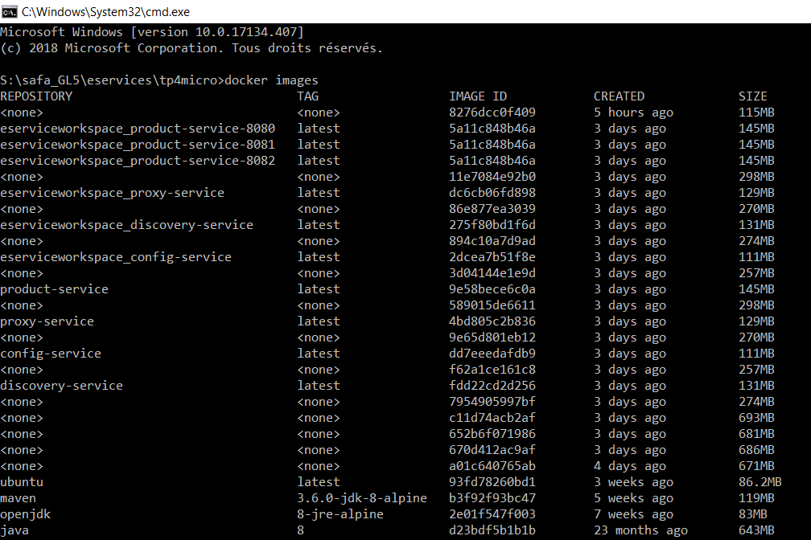
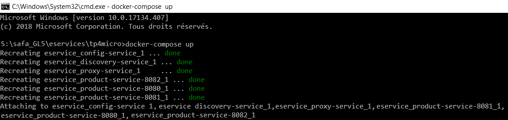
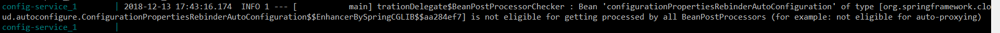
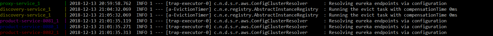

How to: Dockeriser des microservices
=======
<!-- TOC -->
- [Environnement](#Environnement)
- [Architecture Microservices](#microservices-to-deploy-on-docker)
- [Dockeriser les Microservices](#dockeriser-microservices)
	- [Création des Dockerfiles](#Dockerfile)
	- [Création du docker-compose.yml](#Docker-compose)
- [Résultat final](#final)

<!-- /TOC -->

## Environnement
On a besoin de :
- Intellij
- JDK 8 
- Docker (Docker Toolbox si vous n'êtes pas windows10 PRO)

(plus de détails ici --> https://insatunisia.github.io/TP-eServices/tp4/ )

## Architecture Microservices
- Product Service : Service principal, qui offre une API REST pour lister une liste de produits.
- Config Service : Service de configuration, dont le rôle est de centraliser les fichiers de configuration des différents microservices dans un endroit unique.
- Proxy Service : Passerelle se chargeant du routage d'une requête vers l'une des instances d'un service, de manière à gérer automatiquement la distribution de charge.
- Discovery Service: Service permettant l'enregistrement des instances de services en vue d'être découvertes par d'autres services.
**L'architecture résultante aura l'allure suivante:**


## Dockeriser les Microservices
Pour dockerize les microservices, nous devons générer une image Docker à partir de chaque application. 
Ceci peut être réalisé par la création d'un fichier Dockerfile pour chaque microservice puis un fichier Docker compose pour le projet entier.

### Création des Dockerfiles
On crée pour chaque projet son Dockerfile:
Exemple de **Proxy Service:**


```
FROM maven:3.6.0-jdk-8 AS build
WORKDIR /usr/src/app
COPY pom.xml .
RUN mvn dependency:go-offline
COPY src ./src
RUN mvn package -DskipTests

FROM openjdk:8-jre
COPY --from=build /usr/src/app/target/proxy-service.jar /usr/app/
EXPOSE 9999
RUN apk add --no-cache bash
ADD wait-for-it.sh /wait-for-it.sh
CMD ["java","-jar","/usr/app/proxy-service.jar","--spring.profiles.active=docker"] 
```


Puis on exécute la commande  ``docker build -t proxy-service . ``


On vérifie l'ajout des images avec ``docker images``




### Création du docker-compose.yml
**Documentation ->** https://docs.docker.com/compose/


```
version: '3'
services:
  config-service:
    build: config-service
    ports: 
     - "8888:8888"
  
  discovery-service:
    build: discovery-service
    ports: 
     - "8761:8761"
    depends_on:
      - config-service
    entrypoint: /wait-for-it.sh config-service:8888 -t 300 --
    command: java -jar /usr/app/discovery-service-0.0.1-SNAPSHOT.jar --spring.profiles.active=docker
  
  proxy-service:
    build: proxy-service
    ports: 
     - "9999:9999"
    depends_on:
      - discovery-service
    entrypoint: /wait-for-it.sh discovery-service:8761 -t 300 --
    command: java -jar /usr/app/proxy-service-0.0.1-SNAPSHOT.jar --spring.profiles.active=docker
  
  product-service-8080:
    build: product-service
    ports: 
     - "8080:8080"
    depends_on:
      - proxy-service
    entrypoint: /wait-for-it.sh proxy-service:9999 -t 300 --
    command: java -jar /usr/app/TP4-Microservices-0.0.1-SNAPSHOT.jar --spring.profiles.active=docker
  
  product-service-8081:
    build: product-service
    ports: 
     - "8081:8080"
    depends_on:
      - proxy-service
    entrypoint: /wait-for-it.sh proxy-service:9999 -t 300 --
    command: java -jar /usr/app/TP4-Microservices-0.0.1-SNAPSHOT.jar --spring.profiles.active=docker
  
  product-service-8082:
    build: product-service
    ports: 
     - "8082:8080"
    depends_on:
      - proxy-service
    entrypoint: /wait-for-it.sh proxy-service:9999 -t 300 --
    command: java -jar /usr/app/TP4-Microservices-0.0.1-SNAPSHOT.jar --spring.profiles.active=docker 
```
    
	
A partir du dossier où se trouve **docker-compose.yml** on exécute ``docker-compose up`` 




## Résultat final

Voilà ça marche!
Le premier service à démarrer est le config-service



at après les autres services:



